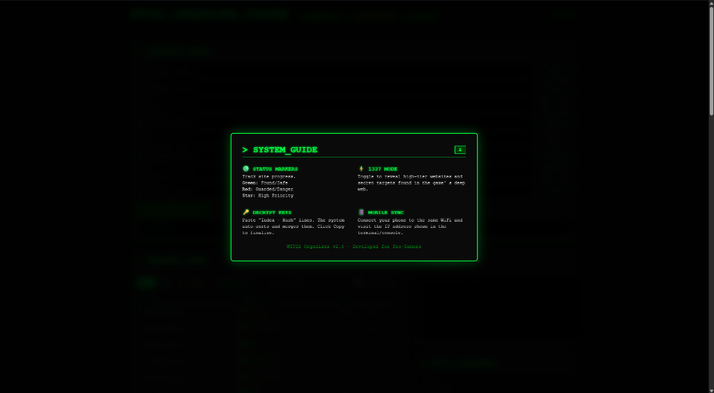

# WTTG2 Organizer System v2.0

A professional, high-performance hacking dashboard and organizer for **WTTG2**. Designed with a premium cyberpunk aesthetic and optimized for both desktop and mobile use via real-time synchronization.


<div align="center">

**Keywords**: `wttg2` `welcome-to-the-game-2` `key-holding` `key-organizer` `hash-vault` `hacking-simulator` `game-utility` `flask` `python` `cyberpunk-ui` `arg-tools`

</div>

## ✨ Features

- **🛡️ Site Availability Tracker**: Complete list of sites with status marks (Safe, Broken, Instahack).
- **📊 Advanced Sorting**: Sort by Original order, Alphabetical (A-Z), Time windows, or prioritized "Always Open" sites.
- **🔍 Real-time Search**: Instant client-side filtering by site name.
- **🟢 Status Markers**: Multi-color neon markers (Green, Red, Star) to track your progress.
- **⚡ 1337 Mode**: Integrated toggle to reveal hidden/high-risk targets.
- **💻 Key Holding / Decrypt**: Automated hash organization & key holding vault with smart-copy features.
- **📡 WiFi Manager**: Store and manage cracked WiFi credentials by location.
- **📝 Secure Notes**: Persistent log area for in-game data.
- **📱 Real-time Sync**: Synchronize data instantly between desktop and mobile devices on the same network.
- **🖥️ Desktop Wrapper**: Clean, windowed experience using `pywebview` (no terminal window required).

## 🚀 Getting Started

### Prerequisites

- Python 3.8 or higher
- [Node.js](https://nodejs.org/) (Optional, if you wish to extend the frontend tooling)

### Installation

1. **Clone the repository**:
   ```bash
   git clone https://github.com/denizstudiox/WTTG2Organizer.git
   cd WTTG2Organizer
   ```

2. **Install dependencies**:
   ```bash
   pip install -r requirements.txt
   ```

### Running the App

Double-click `Run.bat` or run the following command in your terminal:
```bash
python app_launcher.pyw
```

The app will open in a dedicated, borderless window.

## �️ Screenshots


*WTTG2 Organizer Main Dashboard - Clean and responsive interface.*


*Interactive System Guide for new players.*

## �📱 Mobile Sync (WTTG2 Pro Feature)

To access your hacking dashboard from your smartphone while playing:

1. **Connect both devices**: Ensure your phone and PC are on the same WiFi network.
2. **Open the App**: Launch WTTG2 Organizer on your PC.
3. **Get the Link**:
   - Click the **[ ? HELP ]** button in the top right corner.
   - Scan the IP address or type the link shown under "Mobile Sync" into your phone's browser.
   - *Example: `http://192.168.1.XX:1337`*

*(Troubleshooting: If it doesn't load, make sure Windows Firewall allows connections on port **1337**)*

## 🛠️ Tech Stack

- **Backend**: Flask + Flask-SocketIO
- **Frontend**: Vanilla HTML5, CSS3 (Neon-Cyberpunk Theme), JavaScript (ES6)
- **Desktop Wrapper**: PyWebView
- **Persistence**: JSON-based DataManager (Thread-safe)

## 📜 License

This project is open-source and available under the [MIT License](LICENSE).

---
*Disclaimer: This is a fan-made tool for Welcome to the Game II. All game assets and names are property of Reflect Studios.*
